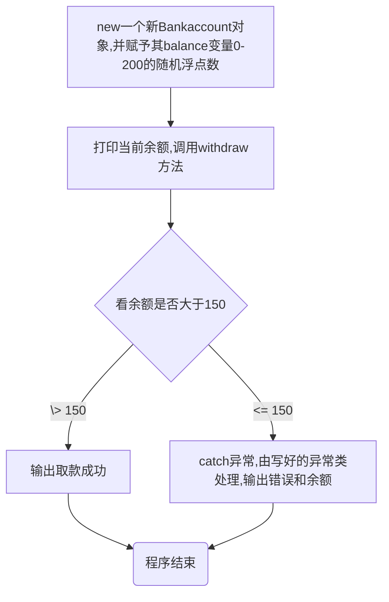

# 
微光后端招新第七题

## ***Task1.异常 Exception 和错误 Error***

#### 1.请举例几个具体的Exception和Error类型以及它们发生的原因，当发生Exception和Error时，程序的处理态度分别应该是什么？

| NullPointerException     | IndexOutOfBoundsException            | ClassNotFoundException | NumberFormatException | IllegalArgumentException       | **IOException** | FileNotFoundException    |
| ------------------------ | ------------------------------------ | ---------------------- | --------------------- | ------------------------------ | --------------- | ------------------------ |
| 使用了一个值为null的对象 | 超出了数组元素个数的范围，索引不存在 | 未找到相应的类         | 数字的格式发生了错误  | 方法接受了一个不符合类型的参数 | 文件操作失败    | 未找到要求访问的文件SQLE |

| OutOfMemoryError  | StackOverflowError         | **TypeError**                    | **OverrideError**      |
| ----------------- | -------------------------- | -------------------------------- | ---------------------- |
| JVM运行时内存不足 | 递归迭代过多导致的栈的耗尽 | 对两个不兼容的数据类型进行了操作 | 子类重写父类时签名异常 |

- 对于Exception，此类异常通常是程序代码出现问题，比如逻辑混乱，使用不当等，是可以恢复的。在运行时exception可以被强制忽视从而继续运行程序。

- 对于Error，此类错误较Exception更为严重，更多地是有关运行环境，如内存等发生错误，导致的重大问题，无法被忽，只能使程序停止运行。

- > （补充）二者在Java中均继承自throwable类，为Java自带的类，对所有异常进行整合，可以提取在栈中的错误信息,从而纠正并管理代码构造并保存在栈中的数据

#### **2.请举例几个具体的checked和unchecked异常以及它们发生的原因，这两种类型的异常有什么区别？**

| checked | ClassNotFoundException | IOException  | SQLException                   |
| ------- | ---------------------- | ------------ | ------------------------------ |
| 原因    | 未找到相应的类         | 文件操作失败 | 数据库错误或违反了数据库的规则 |

| unchecked | ArithmeticalException        | IndexOutOfBoundsException            | NullPointerException     |
| --------- | ---------------------------- | ------------------------------------ | ------------------------ |
| 原因      | 计算格式错误，如除法分母为零 | 超出了数组元素个数的范围，索引不存在 | 使用了一个值为null的对象 |

- checked异常会使编译无法通过，导致编译器编译错误·，一般是与外部资源如文件、服务器对接出现问题，可以通过try-catch、catch等代码处理。

- unchecked异常继承自RuntimeException，可以进行正常编译，但运行时会发生错误，一般是程序自身编写有误，无法用try-catch、catch等代码处理。

- > （补充）Error也会分为VirtualMechineErr与AWTError(不常见)，分别代表虚拟机出现错误及AWT错误。

## ***Task2.异常的处理***

#### 3.以下是一个以银行取款为情景的程序，请你说出该程序运行的所有可能流程。

#### 4.题目：文件读取与数据处理
- 见代码

## PS：为了学生认证把github账号玩崩了😭，新建了一个号，后续会陆续上传前面提交了的题目（以及只写了代码没有写过程的所以没交的，交了但惨不忍睹回去修改的）
## Ps: Ps: 如果有提交的答案实在有问题的话，可以给点提示或建议吗，多谢大佬（敬礼）qq:11887477643（没时间的话也没关系）

#### 参考网址：

[【Java异常】面试官问你Java中的异常，这篇就够了-CSDN博客](https://blog.csdn.net/weixin_52007179/article/details/142813999)

[干货！！！62种Java错误异常汇总 - 知乎 (zhihu.com)](https://zhuanlan.zhihu.com/p/658386570)

[高效问答 | 让知识无界,智能触手可及 (zaiwen.top)](https://www.zaiwen.top/chat/working-edition)

[Java中的异常（checked异常和unchecked异常）_java asserts.check 与sql报错 怎么区分-CSDN博客](https://blog.csdn.net/qq_34039868/article/details/107145009)

[详解Java中的checked异常和unchecked异常-腾讯云开发者社区-腾讯云 (tencent.com)](https://cloud.tencent.com/developer/article/1752363)

[Markdown 进阶技能：用代码画流程图（编程零基础也适用） - 知乎 (zhihu.com)](https://zhuanlan.zhihu.com/p/69495726)

BV1gb42177hm
